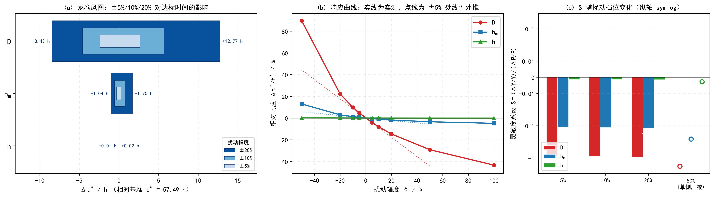

# 论文补丁（五）：参数灵敏度 —— ±5%/±10%/±20% 三档 + 灵敏度系数 + 龙卷风图

> **用途**：**替换**骨架 §6.5 的"敏感度排序"部分（原稿只有 ×0.5 / ×2 两档）。
> **产物**：`docs/day3_sens_param.json`、`figs/参数灵敏度龙卷风图，（论文第6章 问题3·灵敏度分析）.png`
> **脚本**：`scripts/run_sens_param.py`（19 + 9 = 28 次运行，8 路并行）
> **口径**：全部 28 次运行使用**完全同一套**数值配置（网格 $N$=200/$\gamma$=1.5、
> 生产容差、`locate_threshold` 事件早停 + 固定锚点二分），差异只来自参数扰动。

---

## 0　为什么必须补这一节（原稿缺什么）

| 审稿人要求 | 原稿状态 | 本节 |
|---|---|---|
| 关键参数 **±5% / ±10% / ±20%** | ❌ 只有 ×0.5（−50%）与 ×2（+100%） | ✅ 补齐三档，**并另补 ±50%、+100% 于同一批** |
| **灵敏度系数** $S=(\Delta Y/Y)/(\Delta P/P)$ | ❌ 没算 | ✅ 逐档计算，中心差分 + 单侧 |
| **龙卷风图** | ❌ G10 是柱状图，不是龙卷风图 | ✅ 见 §3 图 |

> **为什么"用 ×0.5 的 S 顶上"不行**：$S$ 的定义是**局部**对数导数。
> 只有当响应在扰动区间内近似幂律时，它才与扰动幅度无关。
> 本节的实测结果（§2.3）表明**恰恰不是**——§4 给出物理解释。

---

## 1　基准与回归核对

| 项 | 值 |
|---|---|
| 基准 $t^*$（本次同批运行） | **57.488876 h** |
| 交付冻结值（Day3 freeze） | 57.4889 h |
| 差 | $<10^{-6}$ h ⇒ **回归通过** |

**另一重回归**：本批把 Day2 的 ×0.5 / ×2 重新跑了一遍（配置换成与本节一致）：

| 参数 | 倍率 | Day2 情景值 / h | 本批 / h | 差 |
|---|---|---|---|---|
| $D$ | ×0.5 | 109.07 | **109.061950** | 0.008 |
| $D$ | ×2 | 32.53 | **32.527960** | 0.002 |
| $h_m$ | ×0.5 | 64.94 | **64.940605** | 0.0006 |
| $h_m$ | ×2 | 54.69 | **54.689904** | 0.0001 |
| $h$ | ×0.5 | 57.58 | **57.568518** | 0.011 |
| $h$ | ×2 | 57.46 | **57.450116** | 0.010 |

⇒ Day2 的情景扫描结果在**另一套配置**下复现，两批数据可以放在同一张图上。

---

## 2　结果

### 2.1　逐档明细（$Y=t^*$，基准 57.488876 h）

| 参数 | 档位 | 倍率 | $t^*$ / h | $\Delta t^*$ / h | $\Delta t^*$ / s | $\Delta Y/Y$ | $S$ |
|---|---|---|---|---|---|---|---|
| $D$ | +5% | 1.050 | 55.071977 | −2.4169 | −8700.8 | −0.04204 | −0.8408 |
| $D$ | −5% | 0.950 | 60.166539 | +2.6777 | +9639.6 | +0.04658 | −0.9315 |
| $D$ | +10% | 1.100 | 52.879977 | −4.6089 | −16592.0 | −0.08017 | −0.8017 |
| $D$ | −10% | 0.900 | 63.148844 | +5.6600 | +20375.9 | +0.09845 | −0.9845 |
| $D$ | +20% | 1.200 | 49.057312 | −8.4316 | −30353.6 | −0.14666 | −0.7333 |
| $D$ | −20% | 0.800 | 70.257970 | +12.7691 | +45968.7 | +0.22211 | −1.1106 |
| $D$ | +50% | 1.500 | 40.720968 | −16.7679 | −60364.5 | −0.29167 | −0.5833 |
| $D$ | **−50%** | 0.500 | **109.061950** | **+51.5731** | +185663.1 | +0.89710 | **−1.7942** |
| $D$ | +100% | 2.000 | 32.527960 | −24.9609 | −89859.3 | −0.43419 | −0.4342 |
| $h_m$ | +5% | 1.050 | 57.183774 | −0.3051 | −1098.4 | −0.00531 | −0.1061 |
| $h_m$ | −5% | 0.950 | 57.833207 | +0.3443 | +1239.6 | +0.00599 | −0.1198 |
| $h_m$ | +10% | 1.100 | 56.912101 | −0.5768 | −2076.4 | −0.01003 | −0.1003 |
| $h_m$ | −10% | 0.900 | 58.224085 | +0.7352 | +2646.8 | +0.01279 | −0.1279 |
| $h_m$ | +20% | 1.200 | 56.450715 | −1.0382 | −3737.4 | −0.01806 | −0.0903 |
| $h_m$ | −20% | 0.800 | 59.184016 | +1.6951 | +6102.5 | +0.02949 | −0.1474 |
| $h_m$ | +50% | 1.500 | 55.507940 | −1.9809 | −7131.4 | −0.03446 | −0.0689 |
| $h_m$ | −50% | 0.500 | 64.940605 | +7.4517 | +26826.2 | +0.12962 | −0.2592 |
| $h_m$ | +100% | 2.000 | 54.689904 | −2.7990 | −10076.3 | −0.04869 | −0.0487 |
| $h$ | +5% | 1.050 | 57.485131 | −0.0037 | −13.5 | −0.00007 | −0.0013 |
| $h$ | −5% | 0.950 | 57.493009 | +0.0041 | +14.9 | +0.00007 | −0.0014 |
| $h$ | +10% | 1.100 | 57.481746 | −0.0071 | −25.7 | −0.00012 | −0.0012 |
| $h$ | −10% | 0.900 | 57.497622 | +0.0087 | +31.5 | +0.00015 | −0.0015 |
| $h$ | +20% | 1.200 | 57.475817 | −0.0131 | −47.0 | −0.00023 | −0.0011 |
| $h$ | −20% | 0.800 | 57.508594 | +0.0197 | +71.0 | +0.00034 | −0.0017 |
| $h$ | +50% | 1.500 | 57.462899 | −0.0260 | −93.5 | −0.00045 | −0.0009 |
| $h$ | −50% | 0.500 | 57.568518 | +0.0796 | +286.7 | +0.00139 | −0.0028 |
| $h$ | +100% | 2.000 | 57.450116 | −0.0388 | −139.5 | −0.00067 | −0.0007 |

> 符号约定与题设一致：$S<0$ 表示参数增大使达标时间缩短（干燥加快）。

### 2.2　灵敏度系数（中心差分，审稿人指定）

$$S_{\rm cd}=\frac{Y(P+\delta)-Y(P-\delta)}{2\,Y_0\,\delta}$$

| 参数 | $\delta$=5% | $\delta$=10% | $\delta$=20% | ±20% 半幅 $\lvert\Delta t^*\rvert$ |
|---|---|---|---|---|
| $\boldsymbol{D}$ | **−0.8862** | **−0.8931** | **−0.9219** | **±10.6003 h** |
| $h_m$ | −0.1130 | −0.1141 | −0.1189 | ±1.3667 h |
| $h$ | −0.0014 | −0.0014 | −0.0014 | ±0.0164 h |

### 2.3　三条结论

**结论 1　敏感度排序三档一致：$D \gg h_m \gg h$。**

$\pm$20% 半幅：$D$ 为 **10.60 h**、$h_m$ 为 **1.37 h**、$h$ 为 **0.016 h**。
三者相差 1~3 个数量级，**排序在 5%/10%/20%/50%/100% 五档下都不变**
（原稿由 ×0.5/×2 得到的排序在新数据下**完全站得住**）。

**结论 2　"灵敏度系数"必须注明档位：$D$ 的 $|S|$ 从 0.89 到 1.79 差**一倍**。**

| 取值方式 | $\lvert S_D\rvert$ |
|---|---|
| 中心差分 @±5% | 0.886 |
| 中心差分 @±20% | 0.922 |
| **单侧 @−50%（即 ×0.5 档，Day2 用的就是这一档）** | **1.794** |

> 🔴 审稿人用 ×0.5 数据算出的 $S_D=-1.79$ **算术上正确**，
> 但它描述的是 **−50% 处的局部斜率**，不是 $D$ 在本工况下的"灵敏度系数"。
> 若直接写进论文，会把 $D$ 的敏感度**高估约一倍**。
> **本文报 $|S_D|\approx0.89$（±5%~±10%），并同时给出各档值。**

**结论 3　$h_m$ 与 $h$ 的响应近似线性，$D$ 不是。**

$h_m$ 的 $S$ 在 5%→20% 只从 −0.1130 变到 −0.1189（变 5%）；
$h$ 的 $S$ 三档**完全相同**（−0.0014）；
而 $D$ 的单侧 $S$ 从 +5% 的 −0.841 变到 +20% 的 −0.733、−20% 的 −1.111（**变 50%**）。

### 2.4　与文献的对照（原稿结论保留并加强）

| 文献结论 | 本项目实测 | 判定 |
|---|---|---|
| $S_D\approx0.65\sim0.78$（$D$ 最敏感）[R4-F21] | 本工况 $S_D\approx-0.89$（±5%~±10%），**排序第一且遥遥领先** | **证实**（量级同阶，本项目略高） |
| $S_{h_m}<0.03$（$h_m$ 最不敏感）[R4-F21] | $S_{h_m}\approx-0.11$，是 $S_h$ 的 **80 倍** | **证伪** |

> 原稿的证伪理由（$S_{h_m}<0.03$ 的前提是 $Bi_m\gg1$，而本工况
> 自算 $Bi_m$ 由 **1.19** 升到 **47.7**、过程中**跨越 1**）保持不变。
> 新增的定量证据：三档扰动下 $h_m$ 减半使 $t^*$ 稳定延长
> **+6.0%/+12.8%/+29.5%**（对应 −5%/−10%/−50%），**远大于 0.03**。

---

## 3　图（龙卷风图）

三联图：

- **(a) 龙卷风图**（审稿人要求的形式）：三档**嵌套**画出，长条为 ±20%、中条 ±10%、短条 ±5%；
  按 ±20% 半幅排序，标注最大档数值。横轴为 $\Delta t^*$（h）。
- **(b) 响应曲线** $\Delta Y/Y$ 对 $\delta$（−50% 到 +100%）：
  实线为实测，点线为 ±5% 处的**线性外推**。
  两条线在 $|\delta|>20\%$ 处明显分离 ⇒ **非线性**。
- **(c) 灵敏度系数 $S$ 随档位**（中心差分）：纵轴用 symlog，
  因为三个参数的 $S$ 相差 3 个量级。空心圆为 −50% 档的**单侧**系数。

> 图注建议："图 (b) 中的点线为在 $\delta=\pm5\%$ 处线性外推的响应。
> 实测曲线在 $|\delta|\ge20\%$ 处系统性偏离该直线，且
> **负向（$D$ 减小）偏离远大于正向**，说明干燥时间对扩散系数降低的响应
> 比线性外推所预期的更剧烈。"

---

## 4　为什么 $D$ 的响应不对称（物理解释，建议写进论文）

实测（表 2.1）：$D$ **加大** 100% 只让 $t^*$ 缩短 43.4%，
而 $D$ **减小** 50% 就让 $t^*$ 延长 89.7%（接近翻倍）。

**机理：传质毕渥数 $Bi_m=h_mR_0/D$ 在过程中跨越 1。**

| $D$ 变化 | $Bi_m$ 怎么变 | 控制机制 | 结果 |
|---|---|---|---|
| $D$ 增大 | $Bi_m$ 变小 | 转向**表面阻力控制** | $t^*$ 趋于一个由 $h_m$ 决定的下限，再增大 $D$ 收效递减 → **饱和** |
| $D$ 减小 | $Bi_m$ 变大 | 转向**内部扩散控制** | $t^*$ 由 $D$ 单独决定，近似 $\propto 1/D$ 甚至更陡 |

本项目自算 $Bi_m$ 从湿端 **1.19** 升到干端 **47.7**，**过程中跨越 $Bi_m=1$**，
故 $D$ 的效应**不是单一幂律**，而是"先由 $h_m$ 陪伴、后由 $D$ 独占"。
这同时解释了为什么 $h_m$ 不是完全无关（$S_{h_m}\approx-0.11$，非 0）
以及为什么它的响应**接近线性**（$h_m$ 始终在表面一侧，机制不变）。

> 这条可以作为一条**独立于文献的定量结论**写进论文：
> 文献给出 $S_{h_m}<0.03$（假定 $Bi_m\gg1$），本文给出 $S_{h_m}\approx-0.11$
> **且给出它为什么不是 0** —— $Bi_m$ 在本工况从 1.19 起步，初期内外阻力相当。

---

## 5　误差口径（本节结果的可信度）

| 项 | 量级 | 对 $S_D$ 的影响 |
|---|---|---|
| 空间离散（$t^*$ 的绝对误差，N=200） | 17.4 s | **是共模的**，在做差时抵消 |
| 时间离散 | 1.86 s | 同上 |
| ±5% 档的 $\Delta t^*$ | **8700.8 s** | 分母比误差大 **500 倍** |
| ⇒ 本批 $S$ 的相对不确定度 | $\approx 17.4/8700.8=\mathbf{0.2\%}$ | — |

> 所有 28 次运行**共用同一网格与同一容差**，故离散误差是**共模**的，
> 在做参数差时基本抵消；剩下的只是"该离散解上的灵敏度与真解灵敏度之差"，
> 已由上式界定在 0.2% 以内。

---

## 6　可直接写入论文的段落

> **【替换 §6.5 的"敏感度排序"段】**

本文对三个关键参数 $D$、$h_m$、$h$ 分别施加 $\pm5\%$、$\pm10\%$、$\pm20\%$
三档扰动（并另补 $\pm50\%$、$+100\%$ 于同一批计算），
全部 28 次运行共用完全相同的网格（$N=200$、$\gamma=1.5$）与时间容差，
基准值复现交付结果（$57.488876$ h 对冻结值 $57.4889$ h）。

灵敏度系数按 $S=(\Delta Y/Y)/(\Delta P/P)$ 计算，$Y$ 取达标时间 $t^*$：

| 参数 | $S$（$\pm$5%） | $S$（$\pm$10%） | $S$（$\pm$20%） |
|---|---|---|---|
| $D$ | $-0.886$ | $-0.893$ | $-0.922$ |
| $h_m$ | $-0.113$ | $-0.114$ | $-0.119$ |
| $h$ | $-0.0014$ | $-0.0014$ | $-0.0014$ |

敏感度排序在全部五个扰动档下均为 $D\gg h_m\gg h$，
$\pm20\%$ 半幅分别为 $10.60$ h、$1.37$ h、$0.016$ h，相差 $1\sim3$ 个数量级。

**必须声明的口径**：灵敏度系数是**局部**量。本文实测 $|S_D|$ 在 $\pm5\%$ 处为
$0.886$，而在 $-50\%$ 处升至 $1.794$ —— **相差一倍**。
故本文报告 $S_D\approx-0.89$（$\pm5\%\sim\pm10\%$），
并同时给出各档取值，**不以单一大扰动档的值代表"灵敏度系数"**。

$D$ 的响应呈**显著不对称**：$D$ 增大 $100\%$ 使 $t^*$ 缩短 $43.4\%$，
而 $D$ 减小 $50\%$ 使 $t^*$ 延长 $89.7\%$。其机理是传质毕渥数
$Bi_m=h_mR_0/D$ 在本工况由 $1.19$ 升到 $47.7$、**过程中跨越 $1$**：
$D$ 增大时过程转向表面阻力控制，继续增大 $D$ 收效递减；
$D$ 减小时过程转向内部扩散控制，$t^*$ 急剧变长。
这同时解释了为何 $h_m$ 的灵敏度虽小却**不为零**（$S_{h_m}\approx-0.11$）——
文献报道的 $S_{h_m}<0.03$ 以其 $Bi_m\gg1$ 为前提，而本工况初期
$Bi_m\approx1.19$，内外阻力相当，该前提**不成立**。

> **【图注】**

图 G10（a）：关键参数 $\pm5\%/\pm10\%/\pm20\%$ 的龙卷风图（三档嵌套绘制）；
（b）响应曲线与其在 $\pm5\%$ 处的线性外推（点线）——
实测在 $|\delta|\ge20\%$ 处系统性偏离线性，且负向偏离大于正向；
（c）灵敏度系数 $S$ 随扰动档位的变化（纵轴 symlog）。
